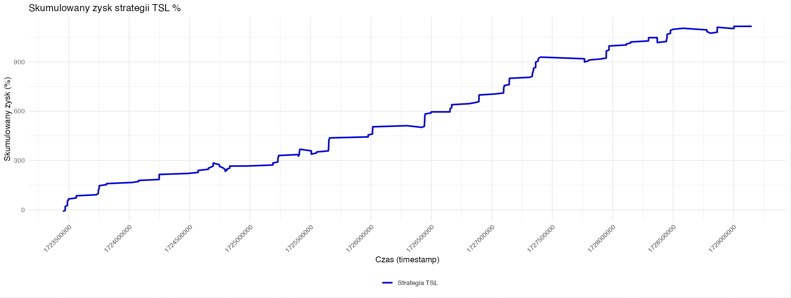

```{r setup, include=FALSE}
knitr::opts_chunk$set(echo = FALSE)
library(jsonlite)
library(corrplot)

data <- fromJSON("data/data-crypto-TAOUSDT-1m.json")
haveNaN <- colSums(is.na(data))
if (any(haveNaN > 0)) {
  data <- na.omit(data)
}
```

## Temat projektu

Z racji iż na codzień oboje programujemy zawodowo i jeden z nas tworzy narzędzia dla inwestorów kryptowalut, mamy dostęp do naszych własnych metryk, które tworzymy.
Chcemy zbadać i pokazać możliwości metryki nazwanej **bsp** (Buy Sell Pressure - Wskaźnik presji zakupowo-sprzedażowej).
Metryka ta pokazuje wartości od **-1** do **1**, gdzie wartość 0 jest wartością neutralną. Wartości powyżej 0 wskazują na **zwiększoną presję sprzedażową**, a wartości poniżej 0 na **zwiększoną presję zakupową**. Metryka ta na pierwszy rzut oka przypomina kształtem i zachowaniem wskaźnik **RSI**, jednak jest od niego dużo precyzyjniejsza, ponieważ nie analizuje ona ceny coina, tylko dane zakupowo sprzedażowe w czasie rzeczywistym.
Pomaga identyfikować możliwe punkty zwrotne na rynku, najlepsze momenty do sprzedaży, gdy metryka jest skrajnie wysoko, oraz do zakupów, gdy metryka jest skrajnie nisko.

## Struktóra danych (kolumny)

**ts**

Jest to zmienna względem której posortowane są wszystkie wiersze od najstarszych do najnowszych. Nazwa ts jest skrótem do nazwy timestamp, czyli czasu podanego w sekundach jaki minął od 1 stycznia 1970 r. godziny 00:00 UTC do danego momentu.

**h**

Jest to także wartość ze świecy OHLC ceny tickera, czyli najwyższa wartość w ciągu minuty - najwyższa cena.

**l**

Low świecy ceny.

## Struktóra danych (kolumny) cd.
**ob_**

Wszystkie zmienne zaczynające się od ob_ dotyczą naszej własnej metryki bsp. Jest ona wyliczana na podstawie aktualnie otworzonych zleceń na giełdach. Są one agregowane na żywo i wykorzystując specjalną formułę wyliczana jest np. metryka ob_10_p_o, która pokazuje stosunek między presją kupna a sprzedaży Bitcoina w zakresie 5% danych od obecnego poziomu ceny. Końcówki o/h/l/c pochodzą od tzw. świec OHLC, które są używane do tworzenia wykresów. Każda litera to skrót do angielskiej nazwy:

- **open** (pierwsza cena aktywa, gdy tworzona jest nowa świeca, w tym przypadku pierwsza cena w każdej minucie)
- **high** (najwyższa cena w danej świecy, czyli najwyższa cena uzyskana przez minutę)
- **low** (najniższa cena)
- **close** (ostatnia cena przed rozpoczęciem nowej świecy)

## Statystyki opisowe danych

```{r}
str(data)
```

## Statystyki opisowe danych cd.
```{r}
summary(data)
```

## Wykryta korelacja

Ze względu iż już kojarzymy tą metrykę, podejrzewamy, że istnieje korelacja między ceną a metryką. Sprawdzimy to za pomocą korelacji Spearmana.
```{r}
cor_matrix <- cor(data[, c("ob_10_p_o", "ob_10_p_h", "ob_10_p_l", "ob_10_p_c", "h", "l")], method = "spearman", use = "complete.obs")
cor_matrix <- round(cor_matrix, 2)

# Rysowanie wykresu korelacji
corrplot(cor_matrix, method = "square", type = "upper", col = colorRampPalette(c("red", "white", "blue"))(200))
```

## Metoda badania

Podejrzewamy, że dzięki metryce bsp **można stworzyć system do handlowania na giełdzie, który przyniesie zyski**.
Analizując wykresy, myślimy, że gdy wartość metryki drastycznie spada (czyli wskazuje na rosnącą presję zakupową), cena po pewnej chwili w większości przypadków zaczyna rosnąć.
By sprawdzić tą tezę, wykonamy teraz szereg działań i obliczeń mających na celu obalić bądź potwierdzić nasze przypusczenia.
Do wykonania testów przygowaliśmy pomocniczą metodę, która przyjmuje parametry:

## Metoda badania cd.
- **past_minutes_percentage** Określa na jakim zakresie ma być liczona procentowa zmiana ceny.
- **past_percentage_min_dropdown** Określa minimalny procentowy spadek ceny w przeszłości wymagany do podjęcia decyzji o kupnie.
- **Y_trail_profit** Określa wartość kroczącego stop lossa, czyli przy jakim % spadku od maksymalnie uzyskanej ceny pozycja ma być sprzedana. Pozwala to zabezpieczyć zyski na wypadek spadków.
- **Y_stop_loss** Określa poziom straty %, przy którym następuje automatyczne zamknięcie pozycji.
- **Y_trail_fixed_profit** Określa poziom zysku %, przy którym następuje automatyczne zamknięcie pozycji.
- **use_avg_price** Określa czy do obliczeń ma być wykorzystana średnia cena akrywa.

## Metody pomocnicze

Do analizy utworzyliśmy pomocnicze metody, oto dwie z nich


- **calculate_percentage_change**

Funkcja do liczenia zmian procentowych
- **calculate_trailing_exit**

Funkcja do wykrywania momentów kiedy pozycja na giełdze powinna być sprzedana

## calculate_percentage_change

<code color="DarkRed" style="width:100%">
```{r, echo=T}
calculate_percentage_change <- function(current_price, past_price) {
  return((current_price - past_price) / past_price * 100)
}
```
</code>

## calculate_trailing_exit

<code color="DarkRed" style="width:100%">
```{r, echo=T}
calculate_trailing_exit <- function(entry_price, prices, trailing_stop_loss, stop_loss, fixed_profit) {
  max_price <- entry_price
  for (price in prices) {
    if (price > max_price) {
      max_price <- price
    }
    
    if (fixed_profit != 0 && price >= entry_price * (1 + fixed_profit / 100)) {
      return(list(price = price, stop_loss_hit = FALSE))
    }
    
    # Sprawdzenie, czy pozycja jest w zysku, tylko wtedy powinien zadziałać tsl (cena > entry_price)
    if (price > entry_price) {
      # Sprawdzenie trailing stop loss (działa tylko jeśli pozycja jest na plusie)
      if (price <= max_price * (1 - trailing_stop_loss / 100)) {
        return(list(price = price, stop_loss_hit = FALSE))
      }
    }
    
    # Sprawdzenie sztywnego stop loss (jeśli cena spadnie poniżej entry_price * (1 - stop_loss / 100))
    if (price <= entry_price * (1 - stop_loss / 100)) {
      return(list(price = entry_price * (1 - stop_loss / 100), stop_loss_hit = TRUE))
    }
  }
  
  # return(list(price = NA, stop_loss_hit = FALSE))
  return(list(price = tail(prices, 1), stop_loss_hit = FALSE))
}
```
</code>


## Wyniki

{width=100%}

## Wyniki cd.
Dzięki przeprowadzonej analizie, udało nam się potwierdzić, że:
- metryka **bsp**, może służyć jako dobry wskażnik pod potencjalne miejsca zakupu, tak by z czasem sprzedać aktywo z zyskiem,
- widizmy, że metryka pokazuje odpowiednio momenty przed prawdopodobnymi wzrostami ceny,
- przed wyjątkami chroni nas tz. **stop loss**, który ucina straty,

Personalnie też dzięki temu projektowi nauczyliśmy się, że:
- ważniejsze jest unikanie strat i branie pewnego niezbyt wysokiego zysku, niż oczekiwanie niewyobrażalnych zwrotów.
- skomplikowaną analizę połączoną z pasją można już na obecnym poziomie wykorzystać do poważnych projektów (prawdopoodbnie po tej analizie zacznę korzystać z tej strategii na live tradingu).


